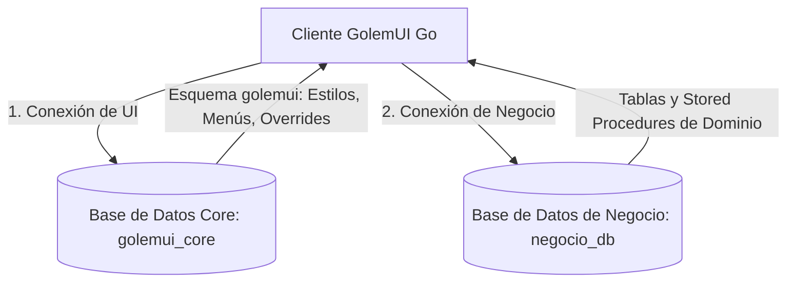
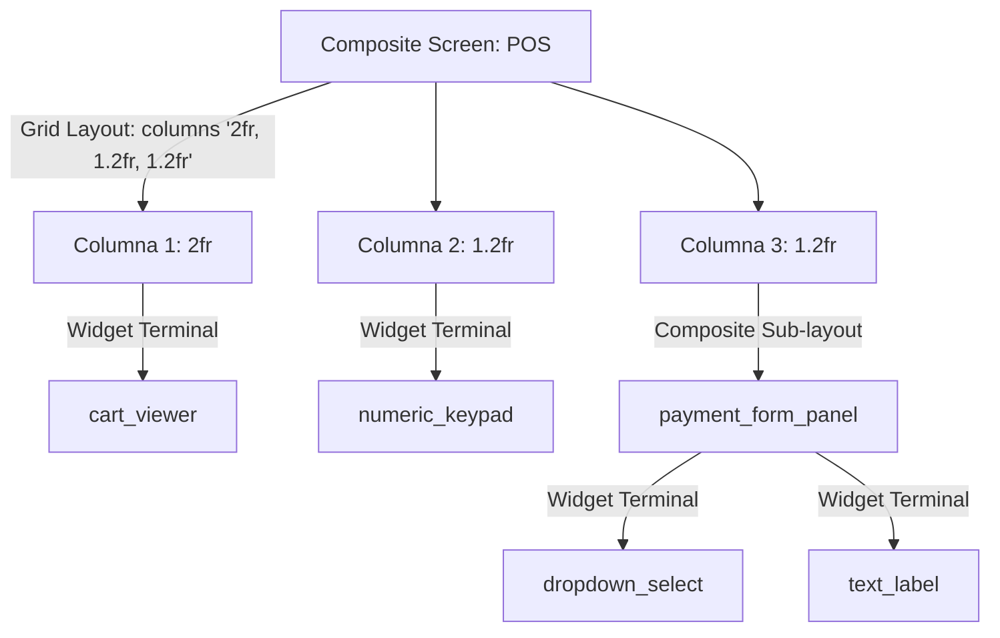

# GolemUI: Manual de Especificaciones Técnicas y Diseño de Arquitectura

GolemUI es un motor de renderizado dinámico y reactivo (Data-Driven UI Engine) desarrollado en Go que desacopla la interfaz de usuario de las fuentes de datos. Toda la estructura visual, la composición de pantallas, el sistema de diseño y los overrides de comportamiento se definen y controlan directamente desde una base de datos centralizada de UI PostgreSQL, aislando por completo las bases de datos de datos de negocio y otros orígenes externos. El cliente utiliza un cargador efímero en Lua para establecer las conexiones iniciales.

Este manual detalla las especificaciones técnicas del motor, estructurado bajo el principio de **separación física de persistencia** y el modelo de desacoplamiento en **cuatro capas**.

---

## 1. Arquitectura General y Flujo de Datos

GolemUI implementa una separación estricta entre la **Base de Datos Core de GolemUI** (donde reside el motor visual y los metadatos) y la o las **Bases de Datos de Negocio** (donde residen los datos del dominio de la aplicación).



### Las Cuatro Capas del Sistema:

1.  **Capa 1: Datos y Esquema Físico (Origen de Datos):** Representa el modelo físico de datos provisto por el origen (la Base de Datos de Negocio local o externa mediante un plugin). Describe estructuras, nombres de columna y tipos de datos nativos sin noción visual.
2.  **Capa 2: Mapeo Lógico Core (Base de Datos Core de GolemUI):** El motor core en la base de datos `golemui_core` interpreta el esquema físico obtenido de la Capa 1 y realiza un mapeo por defecto a **Componentes Lógicos de GolemUI** (ej. un campo de tipo `string` se asocia al componente `text_input`).
3.  **Capa 3: Overrides del Core (Base de Datos Core de GolemUI):** Tabla de configuración en el esquema `golemui` de la base de datos `golemui_core` que permite al desarrollador sobrescribir el mapeo lógico por defecto (ej. forzar que un campo `string` se dibuje como un `dropdown_select`).
4.  **Capa 4: Renderizador Fyne (Cliente Go):** El binario en Go traduce los **Componentes Lógicos de GolemUI** resultantes a objetos gráficos específicos de la librería **Fyne** (`*widget.Entry`, `*widget.Table`, etc.).

---

## 2. El Núcleo del Motor: Composición Jerárquica (Composite Layouts)

El núcleo absoluto de GolemUI en Go es un **Compositor de Layouts Jerárquicos** que procesa recursivamente un árbol de componentes. El motor en Go no cuenta con flujos de pintado paralelos para pantallas simples o complejas; **todas las interfaces de la aplicación se resuelven como un caso particular de una Pantalla Compuesta (`composite_screen`)**.



### El Parser Recursivo
El parser lee el JSON de definición y construye la pantalla de forma jerárquica:
*   **Nodos Contenedores**: Elementos estructurales (`grid`, `flex`, `tabs`) que organizan el espacio en proporción (`fr`, `auto`, `gap`) y anidan otros nodos de manera recursiva.
*   **Nodos Terminales (Widgets)**: Elementos de entrada o salida de datos (`text_input`, `data_grid`, `numeric_keypad`, `click_button`).

### JSON Schema de Pantallas Compuestas (`composite_screen`)

```json
{
  "$schema": "https://json-schema.org/draft/2020-12/schema",
  "title": "GolemUICompositeSpec",
  "type": "object",
  "properties": {
    "ui_title": { "type": "string" },
    "ui_type": { "type": "string", "const": "composite_screen" },
    "layout": {
      "type": "object",
      "properties": {
        "type": { "type": "string", "enum": ["grid", "flex", "tabs"] },
        "columns": { "type": "array", "items": { "type": "string" } },
        "rows": { "type": "array", "items": { "type": "string" } },
        "gap": { "type": "string" }
      },
      "required": ["type"]
    },
    "children": {
      "type": "array",
      "items": {
        "type": "object",
        "properties": {
          "area": { "type": "string" },
          "component_ref": { "type": "string" }, -- Puede ser otro sub-layout o un widget terminal
          "data_source": { "type": "string" },    -- Stored Procedure o vista de negocio
          "submit_action": { "type": "string" },  -- Stored Procedure transaccional
          "bind_to": { "type": "string" },         -- Canal de comunicación en el Event Bus local
          "layout": { "$ref": "#/properties/layout" }, -- Recursividad nativa de layouts
          "children": { "$ref": "#/properties/children" }
        },
        "required": ["area", "component_ref"]
      }
    }
  },
  "required": ["ui_title", "ui_type", "layout", "children"]
}
```

### Reactividad Local del Cliente (Event Bus)
Para evitar la latencia y viajes de red innecesarios al presionar botones o realizar micro-interacciones rápidas, el motor Go implementa un **Event Bus de Cliente** local.
*   Los widgets publican eventos locales en canales de memoria (ej. `number_pressed`, `item_selected`).
*   Otros widgets de la pantalla se suscriben a dichos canales mediante el metadato `"bind_to"`.
*   El estado consolidado se guarda únicamente al confirmar la acción del formulario en la base de datos de negocio.

---

## 3. Consultas y Vistas de Datos bajo el Compositor

Las consultas de datos y reportes se resuelven como una instanciación particular del Compositor Jerárquico. Cuando una pantalla de tipo consulta es invocada, el cliente Go la transforma en memoria en un layout compuesto con dos secciones:

1.  **Filtros (Panel Superior/Lateral)**: Un sub-layout de tipo `flex` o `grid` que renderiza dinámicamente los widgets de filtrado.
2.  **Grilla de Resultados**: Un widget terminal de tipo `data_grid` enlazado a la función de obtención de datos.

### Catálogo de Consultas y Presets en la base de datos `golemui_core`

```sql
CREATE SCHEMA IF NOT EXISTS golemui;

-- Catálogo de pantallas de consulta del sistema
CREATE TABLE golemui.vistas_consulta (
    id VARCHAR(100) PRIMARY KEY,
    titulo VARCHAR(150) NOT NULL,
    origen_datos VARCHAR(150) NOT NULL, -- Nombre de la vista física SQL en la DB de negocio
    config_columnas JSONB NOT NULL,     -- Títulos de columna, tipo de dato, visibilidad
    config_filtros JSONB NOT NULL       -- Definición de filtros permitidos (Ej: rango fecha, texto, fk)
);

-- Vistas personalizadas guardadas por los usuarios (Presets de Filtros)
CREATE TABLE golemui.vistas_guardadas (
    id SERIAL PRIMARY KEY,
    vista_consulta_id VARCHAR(100) REFERENCES golemui.vistas_consulta(id),
    nombre_preset VARCHAR(150) NOT NULL,
    usuario_id VARCHAR(100) NOT NULL,
    filtros_aplicados JSONB NOT NULL,     -- Estado de los filtros: {"estado": "critico", "fecha": "2026-06-04"}
    orden_columnas JSONB,
    es_predeterminada BOOLEAN DEFAULT FALSE
);
```

### Ejecución Dinámica de Consultas
Cuando el usuario cambia filtros en la UI, el cliente Go emite las reglas en un formato JSONB estructurado a la función centralizada en Postgres. El cliente ejecuta esta llamada directamente en la base de datos de negocio o a través de la función del core si existe replicación:

```sql
CREATE OR REPLACE FUNCTION golemui.ejecutar_consulta_filtrada(
    p_vista_id VARCHAR,
    p_filtros_json JSONB,
    p_limit INT DEFAULT 50,
    p_offset INT DEFAULT 0
) RETURNS JSONB AS $$
DECLARE
    v_origen VARCHAR;
    v_sql TEXT;
    v_where TEXT := '1=1';
    v_resultado JSONB;
    r RECORD;
BEGIN
    SELECT origen_datos INTO v_origen FROM golemui.vistas_consulta WHERE id = p_vista_id;
    IF v_origen IS NULL THEN
        RAISE EXCEPTION 'VISTA DE CONSULTA % NO ENCONTRADA', p_vista_id;
    END IF;
    
    FOR r IN SELECT * FROM jsonb_each_text(p_filtros_json)
    LOOP
        IF r.value IS NOT NULL AND r.value <> '' THEN
            v_where := v_where || format(' AND %I::text ILIKE %L', r.key, '%' || r.value || '%');
        END IF;
    END LOOP;
    
    v_sql := format('SELECT json_agg(t) FROM (SELECT * FROM %I WHERE %s LIMIT %L OFFSET %L) t', 
                    v_origen, v_where, p_limit, p_offset);
                    
    EXECUTE v_sql INTO v_resultado;
    RETURN COALESCE(v_resultado, '[]'::jsonb);
END;
$$ LANGUAGE plpgsql SECURITY DEFINER;
```

---

## 4. Auto-Scaffolding y Resolutor de Overrides (Capa 3)

Para resolver pantallas básicas de tipo CRUD de manera automática, GolemUI lee la definición de las columnas del catálogo de la **Base de Datos de Negocio** (`information_schema.columns`) e infiere los componentes correspondientes por defecto. Para personalizar comportamientos (Capa 3), el core utiliza la tabla de mapeo y overrides ubicada en la base de datos `golemui_core`:

```sql
-- Tabla central de overrides de interfaz (Capa 3) - Vive en golemui_core
CREATE TABLE golemui.mapeo_interfaz (
    origen_id VARCHAR(100) NOT NULL,       -- Nombre de tabla, vista o procedimiento
    columna_fisica VARCHAR(100) NOT NULL, -- Columna o argumento de datos (Ej: 'rol_id')
    component_ref VARCHAR(50) NOT NULL,   -- Componente lógico asignado (Ej: 'dropdown_select')
    label VARCHAR(150),
    placeholder VARCHAR(250),
    validation VARCHAR(250),
    PRIMARY KEY (origen_id, columna_fisica)
);
```

Al cargarse una pantalla, el motor en Go realiza la introspección física consultando el origen de negocio (Capa 1) y resuelve el componente lógico final de cada control (Capa 2) aplicando la precedencia del override (Capa 3) obtenido de la base de datos `golemui_core`:

$$\text{Mapeo por Defecto de Capa 2 (Inferencia de Tipo en Negocio)} \quad \longrightarrow \quad \text{Mapeo Personalizado de Capa 3 (Override en golemui_core)}$$

---

## 5. El Esquema de Sistema `golemui` en la base de datos `golemui_core`

El catálogo de componentes de UI soportados por GolemUI define las primitivas lógicas de interfaz que procesa el motor:

```sql
-- Catálogo de componentes de UI estándar
CREATE TABLE golemui.componentes (
    id VARCHAR(50) PRIMARY KEY,
    descripcion TEXT NOT NULL
);

INSERT INTO golemui.componentes (id, descripcion) VALUES
('click_button', 'Botón de ejecución transaccional'),
('text_input', 'Input de texto de una sola línea'),
('text_area', 'Input de texto multilínea'),
('numeric_stepper', 'Selector numérico con límites definidos'),
('barcode_reader', 'Control optimizado para entrada de escáneres rápidos'),
('data_grid', 'Grilla estructurada para visualización y selección de filas'),
('dropdown_select', 'Selector de opciones basado en claves foráneas'),
('date_picker', 'Selector gráfico de fechas calendarizadas'),
('checkbox_toggle', 'Selector booleano interactivo'),
('numeric_keypad', 'Teclado numérico táctil para ingreso rápido de datos');

-- Sistema de Diseño Semántico (Semantic Design Tokens)
CREATE TABLE golemui.estilos (
    id VARCHAR(50) PRIMARY KEY,
    color_fondo VARCHAR(7) NOT NULL,
    color_texto VARCHAR(7) NOT NULL,
    border_radius VARCHAR(20) NOT NULL DEFAULT 'smooth', -- 'sharp', 'smooth', 'rounded'
    font_size VARCHAR(20) NOT NULL DEFAULT 'medium',     -- 'small', 'medium', 'large'
    font_weight VARCHAR(20) NOT NULL DEFAULT 'normal'    -- 'light', 'normal', 'bold'
);

INSERT INTO golemui.estilos (id, color_fondo, color_texto, border_radius, font_size, font_weight) VALUES
('primary_action', '#3498db', '#ffffff', 'smooth', 'medium', 'bold'),
('success', '#2ecc71', '#ffffff', 'smooth', 'medium', 'bold'),
('danger', '#e74c3c', '#ffffff', 'smooth', 'medium', 'bold'),
('input_standard', '#ffffff', '#2c3e50', 'sharp', 'small', 'normal'),
('sidebar_panel', '#2c3e50', '#ecf0f1', 'sharp', 'small', 'normal'),
('table_header', '#34495e', '#ffffff', 'sharp', 'small', 'bold'),
('table_cell', '#ffffff', '#2c3e50', 'sharp', 'small', 'normal');
```

---

## 6. Control de Estado de Sesión en la base de datos `golemui_core`

GolemUI promueve que el cliente Go no mantenga estado de negocio. Sin embargo, flujos interactivos complejos requieren acumular cambios en memoria antes de la confirmación física.

Para evitar inconsistencias por caídas de red o cancelaciones y mantener la ligereza del cliente, GolemUI implementa un esquema de almacenamiento temporal en la base de datos `golemui_core` vinculado a la sesión de la aplicación.

```sql
-- Tabla genérica para almacenamiento temporal de formularios / borradores
CREATE TABLE golemui.sesion_borrador (
    id SERIAL PRIMARY KEY,
    session_id VARCHAR(100) NOT NULL,  -- Identificador de sesión de GolemUI
    clave_campo VARCHAR(100) NOT NULL, -- Nombre de la variable / control
    valor_json JSONB NOT NULL,          -- Contenido del dato serializado
    creado_en TIMESTAMP DEFAULT CURRENT_TIMESTAMP
);

CREATE INDEX idx_golemui_borrador_sesion ON golemui.sesion_borrador(session_id);
```

---

## 7. Estándar de Metadatos (JSON Schema en `COMMENT ON` de Stored Procedures)

Las pantallas de formularios simples mapeadas a Stored Procedures también son procesadas por el compositor. Al momento de invocarse, se transforman en una `composite_screen` de una sola columna y un botón de acción.

```json
{
  "$schema": "https://json-schema.org/draft/2020-12/schema",
  "title": "GolemUICommentSpec",
  "type": "object",
  "properties": {
    "ui_title": { "type": "string" },
    "ui_type": { "type": "string", "enum": ["form_action", "view_panel", "hybrid_screen"] },
    "ui_layout": {
      "type": "object",
      "properties": {
        "menu_zone": { "type": "string" },
        "order": { "type": "integer" },
        "zone": { "type": "string", "enum": ["main_content", "sidebar_right", "sidebar_left", "header", "footer"] },
        "component": { "type": "string" },
        "style_ref": { "type": "string" }
      },
      "required": ["menu_zone", "order", "zone", "component", "style_ref"]
    },
    "arguments": {
      "type": "object",
      "additionalProperties": {
        "type": "object",
        "properties": {
          "component_ref": { "type": "string" },
          "label": { "type": "string" },
          "placeholder": { "type": "string" },
          "default_value": { "type": "string" },
          "min": { "type": "number" },
          "max": { "type": "number" },
          "validation": { "type": "string" }
        },
        "required": ["component_ref", "label"]
      }
    }
  },
  "required": ["ui_title", "ui_type", "ui_layout", "arguments"]
}
```

---

## 8. Arquitectura del Cliente en Go (Toolkit Fyne)

El cliente de escritorio y móvil de GolemUI está desarrollado en Go utilizando el toolkit gráfico **Fyne** (Capa 4). Go es un intérprete que traduce los **Componentes Lógicos de GolemUI** a widgets físicos de Fyne.

### Mapeo de Componentes Lógicos de GolemUI a Widgets de Fyne

El adaptador gráfico traduce la especificación lógica del core al runtime del toolkit:

| Componente Lógico GolemUI | Widget Fyne | Comportamiento del Widget |
| :--- | :--- | :--- |
| `text_input` | `*widget.Entry` | Entrada de texto estándar de una sola línea. |
| `text_area` | `*widget.Entry` | Input multilínea (`MultiLine = true`) con scroll. |
| `numeric_stepper` | `*fyne.Container` | `*widget.Entry` numérico custodiado por dos `*widget.Button` (`-` y `+`). |
| `checkbox_toggle` | `*widget.Check` | Selector booleano tipo checkbox. |
| `date_picker` | `*widget.Entry` | Input con máscara y modal popup (`dialog.Custom`) de calendario. |
| `dropdown_select` | `*widget.Select` | Selector con dropdown de opciones de texto. |
| `data_grid` | `*widget.Table` | Grilla virtualizada que consume un dataset local de memoria de forma asíncrona. |

### Modelo de Datos del Motor

```go
package core

import (
	"fyne.io/fyne/v2"
)

type EstiloToken struct {
	ColorFondo   string `json:"color_fondo"`
	ColorTexto   string `json:"color_texto"`
	BorderRadius string `json:"border_radius"`
	FontSize     string `json:"font_size"`
	FontWeight   string `json:"font_weight"`
}

type LayoutMeta struct {
	Type    string   `json:"type"`
	Columns []string `json:"columns"`
	Rows    []string `json:"rows"`
	Gap     string   `json:"gap"`
}

// NodeMeta representa la estructura recursiva del componente en el compositor
type NodeMeta struct {
	Area          string     `json:"area"`
	ComponentRef  string     `json:"component_ref"` -- Componente Lógico de GolemUI (Capa 2 y 3)
	Label         string     `json:"label,omitempty"`
	Placeholder   string     `json:"placeholder,omitempty"`
	DefaultValue  string     `json:"default_value,omitempty"`
	Min          float64    `json:"min,omitempty"`
	Max          float64    `json:"max,omitempty"`
	Validation    string     `json:"validation,omitempty"`
	DataSource    string     `json:"data_source,omitempty"`
	SubmitAction  string     `json:"submit_action,omitempty"`
	BindTo        string     `json:"bind_to,omitempty"`
	Layout        LayoutMeta `json:"layout,omitempty"`
	Children      []NodeMeta `json:"children,omitempty"`
}

type AppContext struct {
	DesignSystem     map[string]EstiloToken
	MenuScreens      []map[string]interface{}
	ActiveScreenRoot NodeMeta
	ControlInstances map[string]fyne.CanvasObject
	ScreenCache      map[string]NodeMeta
	UIDBConnection   DatabaseConnection      -- Conexión dedicada a golemui_core
	BizDBConnection  DatabaseConnection      -- Conexión dedicada a la Base de Datos de Negocio activa
}
```

### El Compositor Jerárquico en Fyne

El compositor procesa recursivamente la especificación y arma los contenedores de Fyne en tiempo de ejecución:

```go
package core

import (
	"fyne.io/fyne/v2"
	"fyne.io/fyne/v2/container"
	"fyne.io/fyne/v2/widget"
)

func (app *AppContext) RenderizarCompositeScreen(node NodeMeta) fyne.CanvasObject {
	if node.ComponentRef != "" && len(node.Children) == 0 {
		return app.ConstruirWidgetFyne(node)
	}

	var childrenObjects []fyne.CanvasObject
	for _, child := range node.Children {
		childrenObjects = append(childrenObjects, app.RenderizarCompositeScreen(child))
	}

	switch node.Layout.Type {
	case "grid":
		colsCount := len(node.Layout.Columns)
		return container.NewGridWithColumns(colsCount, childrenObjects...)
		
	case "flex":
		if len(node.Layout.Columns) > 0 {
			return container.NewHBox(childrenObjects...)
		}
		return container.NewVBox(childrenObjects...)
		
	case "tabs":
		tabs := container.NewAppTabs()
		for i, obj := range childrenObjects {
			tabs.Append(container.NewTabItem(node.Children[i].Area, obj))
		}
		return tabs
	}

	return container.NewMax()
}
```

### Encapsulamiento del DataGrid y Despacho Asíncrono

```go
package core

import (
	"context"
	"encoding/json"
	"fmt"
	"log"

	"fyne.io/fyne/v2"
	"fyne.io/fyne/v2/widget"
)

type DataGridWidget struct {
	Table      *widget.Table
	ColumnKeys []string
	Data       []map[string]interface{}
}

func NewDataGridWidget(columnKeys []string) *DataGridWidget {
	dg := &DataGridWidget{
		ColumnKeys: columnKeys,
		Data:       make([]map[string]interface{}, 0),
	}

	dg.Table = widget.NewTable(
		func() (int, int) { return len(dg.Data), len(dg.ColumnKeys) },
		func() fyne.CanvasObject { return widget.NewLabel("Celda Base") },
		func(id widget.TableCellID, cell fyne.CanvasObject) {
			label := cell.(*widget.Label)
			if id.Row < len(dg.Data) {
				key := dg.ColumnKeys[id.Col]
				val := dg.Data[id.Row][key]
				label.SetText(fmt.Sprintf("%v", val))
			}
		},
	)
	return dg
}

func (app *AppContext) CargarDatosGrillaAsincrono(dg *DataGridWidget, node NodeMeta, filtros map[string]interface{}) {
	go func() {
		// El fetch se realiza contra la conexión de base de datos de negocio
		datosJSON, err := app.EjecutarFetchDeDatosNegocio(context.Background(), node.DataSource, filtros)
		if err != nil {
			log.Printf("[UI ERROR] Error al recuperar datos de negocio: %v", err)
			return
		}

		var nuevosDatos []map[string]interface{}
		if err := json.Unmarshal(datosJSON, &nuevosDatos); err != nil {
			log.Printf("[UI ERROR] JSON malformado: %v", err)
			return
		}

		app.UIThreadExecute(func() {
			dg.Data = nuevosDatos
			dg.Table.Refresh()
		})
	}()
}

func (app *AppContext) ConstruirWidgetFyne(meta NodeMeta) fyne.CanvasObject {
	if !app.IsComponentSupported(meta.ComponentRef) {
		return widget.NewLabel("[WARNING] Componente no soportado: " + meta.ComponentRef)
	}

	switch meta.ComponentRef {
	case "text_input":
		entry := widget.NewEntry()
		entry.SetPlaceHolder(meta.Placeholder)
		return entry
		
	case "data_grid":
		columnKeys := app.ExtraerKeysColumnas(meta)
		dg := NewDataGridWidget(columnKeys)
		app.CargarDatosGrillaAsincrono(dg, meta, nil)
		app.ControlInstances[meta.Area] = dg.Table
		return dg.Table
	}
	return widget.NewLabel("")
}
```

---

## 9. Bootstrap de Conexión en Lua

Lua actúa únicamente como un intermediario ágil para cargar las credenciales y ejecutar la consulta inicial del motor. Configura conexiones independientes para el core de UI (`golemui_core`) y la base de datos de negocio activa (`negocio_db`).

### Driver de Arranque: `golemui_driver.lua`

```lua
-- golemui_driver.lua
local GolemUIDriver = {}

-- 1. Conexión a la Base de Datos Core de GolemUI (Metadatos visuales)
GolemUIDriver.ui_db = {
    host     = "127.0.0.1",
    port     = 5432,
    database = "golemui_core",
    user     = "golemui_core_engine",
    password = "secret_password_for_ui"
}

-- 2. Conexión a la Base de Datos de Negocio por defecto
GolemUIDriver.business_db = {
    host     = "127.0.0.1",
    port     = 5432,
    database = "negocio_production",
    user     = "golemui_render_engine",
    password = "secret_password_for_business"
}

-- 3. Query de Arranque de UI (Se ejecuta en golemui_core)
GolemUIDriver.entry_point_query = [[
    SELECT
        (SELECT golemui.obtener_inicializacion_motor()) AS motor_config,
        (SELECT golemui.obtener_menu_sistema()) AS menu
]]

return GolemUIDriver
```

### Control de VM en Go y Carga Multiproveedor

```go
package core

import (
	"errors"
	"github.com/yuin/gopher-lua"
)

type ConfigConexion struct {
	Host     string
	Port     int
	Database string
	User     string
	Password string
}

type BootstrapConfig struct {
	UIDB            ConfigConexion
	BusinessDB      ConfigConexion
	EntryPointQuery string
}

func InicializarBootstrap(path string) (*BootstrapConfig, error) {
	L := lua.NewState()
	// Liberación inmediata del estado de la VM para evitar fugas de memoria
	defer L.Close()

	if err := L.DoFile(path); err != nil {
		return nil, err
	}

	tbl, ok := L.Get(-1).(*lua.LTable)
	if !ok {
		return nil, errors.New("formato de driver de configuración inválido")
	}

	uiTbl, okui := tbl.RawGetString("ui_db").(*lua.LTable)
	bizTbl, okbiz := tbl.RawGetString("business_db").(*lua.LTable)
	if !okui || !okbiz {
		return nil, errors.New("se requieren las secciones ui_db y business_db en la configuración")
	}

	config := &BootstrapConfig{
		UIDB: ConfigConexion{
			Host:     uiTbl.RawGetString("host").String(),
			Port:     int(uiTbl.RawGetString("port").(lua.LNumber)),
			Database: uiTbl.RawGetString("database").String(),
			User:     uiTbl.RawGetString("user").String(),
			Password: uiTbl.RawGetString("password").String(),
		},
		BusinessDB: ConfigConexion{
			Host:     bizTbl.RawGetString("host").String(),
			Port:     int(bizTbl.RawGetString("port").(lua.LNumber)),
			Database: bizTbl.RawGetString("database").String(),
			User:     bizTbl.RawGetString("user").String(),
			Password: bizTbl.RawGetString("password").String(),
		},
		EntryPointQuery: tbl.RawGetString("entry_point_query").String(),
	}

	return config, nil
}
```

---

## 10. Herramientas y Validaciones en Tiempo de Desarrollo

Para eliminar la resistencia de los desarrolladores al escribir estructuras JSON complejas dentro de sentencias SQL `COMMENT ON`, se integra la herramienta CLI `golemui`.

```bash
# Validar estructura y correspondencia de argumentos antes de aplicar migraciones
golemui validate-comments --file ./migrations/20260604_clinica_medica.sql
```

Esta herramienta analiza:
- Validez sintáctica del JSON.
- Mapeo de argumentos contra la firma del Stored Procedure de Postgres.
- Existencia de referencias a tokens de estilo en `golemui.estilos`.

---

## 11. Extensibilidad y Orígenes de Datos Heterogéneos

Para conocer cómo GolemUI soporta la conexión a orígenes de datos externos (Microsoft SQL Server, APIs REST, servicios gRPC) y la carga dinámica de Shared Objects en Go, consulte el [Manual de Especificación de Plugins](file:///src/GolemUI/docs/golemui_plugins_document.md).
