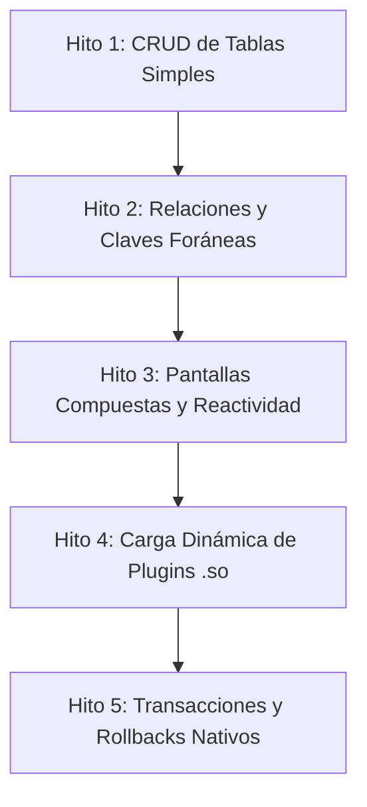

# GolemUI: Historias de Usuario Globales y Hoja de Ruta del MVP

Este documento define las historias de usuario y criterios de aceptación estructurados que guiarán el desarrollo incremental del motor **GolemUI** hasta alcanzar el primer MVP funcional.

---

## Propósito y Visión General
Este backlog de historias de usuario detalla la evolución técnica del sistema desde la base estructurada (Go + Fyne + DB) hasta el soporte de pantallas transaccionales complejas. Ayuda a desarrolladores e IAs a comprender las metas funcionales del proyecto, asegurando que cada incremento sea *Production-First* y completamente testable mediante TDD.

---

## Hoja de Ruta: Hitos del MVP

---

## Hito 1: CRUD de Tablas Simples (Greenfield)

### Historia 1: Renderizado Automático desde Esquema Físico (Capas 1, 2 y 4)
**COMO** desarrollador de la aplicación,  
**QUIERO** que GolemUI detecte automáticamente el tipo de dato físico de una tabla de negocio,  
**PARA QUE** dibuje los componentes visuales correspondientes en la interfaz sin necesidad de configuraciones manuales de UI.

| Tipo Físico (Capa 1) | Componente Lógico (Capa 2) | Widget Fyne (Capa 4) |
|---|---|---|
| `VARCHAR` / `TEXT` | `text_input` | `*widget.Entry` (Simple) |
| `INTEGER` / `NUMERIC` | `number_input` | `*widget.Entry` (Restringido a dígitos) |
| `BOOLEAN` | `checkbox` | `*widget.Check` |

#### Criterios de Aceptación (TDD Scenarios)
*   **GIVEN** una tabla de negocio `public.categorias` con un campo `nombre` (`VARCHAR`),  
    **WHEN** el cliente Go arranca y consulta el esquema físico,  
    **THEN** el compositor debe instanciar un contenedor Fyne con un widget `*widget.Entry`.
*   **GIVEN** un campo de tipo `INTEGER`,  
    **WHEN** el usuario ingresa caracteres alfabéticos en el campo de entrada en Fyne,  
    **THEN** el widget debe rechazar la entrada, permitiendo únicamente dígitos numéricos.

---

### Historia 2: Sobrescritura de Componentes por Defecto (Capa 3 - Overrides)
**COMO** desarrollador de la aplicación,  
**QUIERO** forzar que un campo físico se dibuje con un componente lógico diferente al asignado por defecto,  
**PARA QUE** la interfaz se adapte mejor a las necesidades de captura de datos (ej. un texto largo mapeado a un textarea).

#### Criterios de Aceptación (TDD Scenarios)
*   **GIVEN** un registro en `golemui.mapeo_interfaz` que asocie el campo `descripcion` (`TEXT`) con el componente `text_area`,  
    **WHEN** el compositor dibuja la pantalla del formulario,  
    **THEN** debe instanciar un `*widget.Entry` con la propiedad `MultiLine = true` en lugar del input de línea simple por defecto.

---

## Hito 2: Relaciones y Claves Foráneas (FK)

### Historia 3: Selector de Claves Foráneas (Dropdown Dinámico)
**COMO** usuario del sistema,  
**QUIERO** seleccionar valores de tablas relacionadas mediante menús desplegables en lugar de ingresar IDs numéricos,  
**PARA** evitar cometer errores de consistencia en los datos.

#### Criterios de Aceptación (TDD Scenarios)
*   **GIVEN** una tabla de negocio `public.productos` con una FK `categoria_id` apuntando a `public.categorias`,  
    **WHEN** el formulario de productos se renderiza,  
    **THEN** el motor debe consultar los valores de `public.categorias` en segundo plano,  
    **AND** instanciar un widget `*widget.Select` (dropdown) poblado con los nombres lógicos de las categorías, guardando el ID correspondiente al confirmar.

---

## Hito 3: Pantallas Compuestas y Reactividad Local

### Historia 4: Composición de Pantallas Multicolumna (Layouts Jerárquicos)
**COMO** diseñador de interfaces de usuario,  
**QUIERO** definir paneles complejos con grillas y proporciones variables directamente en la base de datos,  
**PARA** estructurar pantallas avanzadas (como paneles de venta o dashboards) de manera 100% dinámica.

#### Criterios de Aceptación (TDD Scenarios)
*   **GIVEN** una pantalla definida en `golemui.pantallas` con layout `"grid"` y columnas `["2fr", "1fr"]`,  
    **WHEN** el compositor recursivo en Go procesa el árbol de componentes,  
    **THEN** debe renderizar un contenedor Fyne usando el `FractionalLayout`,  
    **AND** posicionar los paneles hijos asignando un tercio de la pantalla a la segunda columna y dos tercios a la primera.

---

### Historia 5: Reactividad entre Componentes Locales (Event Bus)
**COMO** operador de caja,  
**QUIERO** que al presionar un botón de la grilla de productos o del teclado numérico se actualice el visualizador de la orden en tiempo real,  
**PARA** operar de forma rápida y sin latencia de red.

#### Criterios de Aceptación (TDD Scenarios)
*   **GIVEN** un widget de tipo `numeric_keypad` con la propiedad `bind_to = "pos_keypad"` y un widget `text_label` suscrito al canal `"pos_keypad"`,  
    **WHEN** el usuario presiona el botón `"5"` en el teclado numérico,  
    **THEN** el bus de eventos en memoria debe propagar el carácter `"5"`,  
    **AND** el label debe actualizar su texto para mostrar `"5"` de forma instantánea sin realizar llamadas a la base de datos.

---

## Hito 4: Carga Dinámica de Plugins de Datos (`.so`)

### Historia 6: Integración de Orígenes de Datos Heterogéneos
**COMO** arquitecto del sistema,  
**QUIERO** compilar módulos conectores independientes en archivos de biblioteca dinámica (`.so`),  
**PARA** conectar a GolemUI con bases de datos externas (MSSQL, MySQL) o microservicios sin recompilar el núcleo del cliente Go.

#### Criterios de Aceptación (TDD Scenarios)
*   **GIVEN** un conector compilado `plugins/mssql.so` que implementa la interfaz `dbplugin.DataConnector`,  
    **WHEN** el cliente Go inicia y encuentra el archivo en la carpeta `./plugins`,  
    **THEN** debe cargar dinámicamente el plugin mediante `plugin.Open`,  
    **AND** permitir realizar la introspección física de tablas a través del método `GetSchema` del plugin.

---

## Hito 5: Transaccionalidad y Control de Errores Nativos

### Historia 7: Confirmación Transaccional y Reversión Automática (Rollbacks)
**COMO** usuario del sistema,  
**QUIERO** confirmar la creación o edición de un formulario completo de forma atómica,  
**PARA** garantizar que no queden datos parciales corruptos en el servidor si ocurre una falla de validación de negocio.

#### Criterios de Aceptación (TDD Scenarios)
*   **GIVEN** un formulario de transacción financiera compuesto,  
    **WHEN** el usuario presiona el botón "Guardar",  
    **THEN** el motor debe ejecutar el Stored Procedure transaccional configurado en la base de datos de negocio,  
    **AND IF** el Stored Procedure dispara un `RAISE EXCEPTION` debido a fondos insuficientes,  
    **THEN** el motor en Go debe capturar el error,  
    **AND** asegurar el rollback automático de la base de datos,  
    **AND** mostrar el mensaje de error de negocio al usuario en una ventana modal de Fyne sin recargar la pantalla.

---

## Próximos Pasos Inmediatos (Lista de Tareas Técnica)
Para iniciar la siguiente iteración de desarrollo posterior a la base del cliente:

- [ ] **Interface & Mocking**: Diseñar la abstracción de base de datos para mockear las llamadas a `pkg/db` e incrementar la cobertura a >80% en `cmd/golemui/main_test.go`.
- [ ] **Tab Container Widget**: Extender `pkg/ui/compositor.go` para mapear el contenedor `"tabs"` a `container.NewAppTabs`.
- [ ] **DataGrid Base**: Implementar la representación visual inicial del widget `"data_grid"` mapeado a `widget.Table` de Fyne en `pkg/ui/compositor.go` con datos dummy locales.
