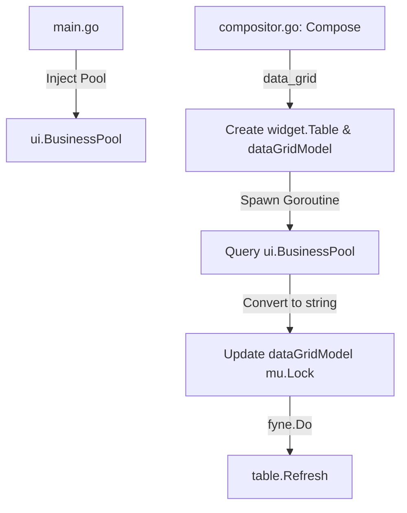

# Proposal: GolemUI Data Grid Async Loading

## Intent
Enable asynchronous rendering of the `data_grid` component using Fyne's `widget.Table`, executing queries in the background and updating UI thread-safely.

## Capabilities

| New Capabilities | Modified Capabilities |
| :--- | :--- |
| `data-grid-component-rendering` | None |
| `asynchronous-data-source-querying` | |

## Affected Areas

- `cmd/golemui/main.go`: Initialize and assign the database pool to `ui.BusinessPool`.
- `pkg/ui/compositor.go`: Map `"data_grid"` component, define thread-safe `dataGridModel`, run async queries, update model, and refresh via `fyne.Do`.
- `pkg/ui/compositor_test.go`: Add tests using `MockDBPool` to verify asynchronous composition and data mapping.

## Technical Approach



- **Database Pool Assignment**: Set `ui.BusinessPool` from `main.go`.
- **Model Structuring**:
  ```go
  type dataGridModel struct {
      mu      sync.RWMutex
      cols    []string
      data    [][]string
  }
  ```
- **Fyne Widget Integration**: Map `"data_grid"` to `*widget.Table` bound to `dataGridModel`.
- **Asynchronous Loading**:
  - Run the query string from `data_source` on `ui.BusinessPool` in a background goroutine.
  - Iterate records, read values, format to string, and acquire lock to write to the model.
  - Call `fyne.Do(func() { table.Refresh() })` to schedule UI updates safely.

## Success Criteria

1. **Compilation**: Zero compilation errors under standard Go build.
2. **Reactivity**: Rendering a `data_grid` does not block the UI main thread.
3. **Data Verification**: Tables correctly display column headers and cell values fetched from the database.
4. **Thread Safety**: Zero data races detected during tests run with `go test -race ./...`.

## Rollback Plan

To revert this change:
- Revert modifications to `cmd/golemui/main.go`, `pkg/ui/compositor.go`, and `pkg/ui/compositor_test.go` using Git:
  ```bash
  git checkout main -- cmd/golemui/main.go pkg/ui/compositor.go pkg/ui/compositor_test.go
  ```
